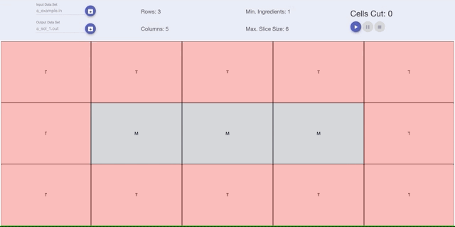

# Hash Code 19 Pizza Viewer

Sometimes, it's way too hard to keep in our mind all the possibilities and paths an algorithm is taking. [The Hash Code 2019 Practice Problem](https://hashcodejudge.withgoogle.com/#/home) is a good example.

This pizza viewer tries to help people to better understand what the provided solution is doing, because sometimes improvements are easier to find when using a visual tool. You can use it online [here](https://tobertet.github.io/hash-code-pizza-viewer/).

## Example Problem

## Running Locally

Clone the repo, go to the root of the project and run npm start. You will need npm and the angular CLI installed globally.

## Contributing

Just make a PR with anything you wanted to add.
